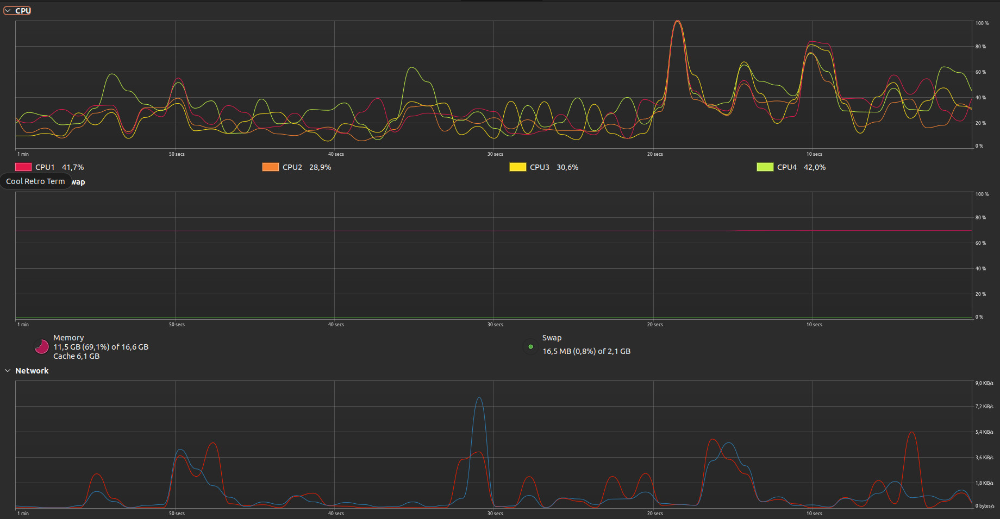

# Previewer

## Install go

[Go install](https://go.dev/doc/install)

## Run it locally

```shell
go run src/main.go -src "path/to/images" -templates "path/to/templates"
```
## Run with docker
```shell
docker run -v your/path/to/imagesrc:/app/src -v your/path/to/templates:/app/templates ghcr.io/ckroeger/previewer:1.0.1
```

## Build docker image (locally)
```shell
docker build -t previewer .
```

## Run it in docker (locally)
```shell
docker run -it -v `pwd`:/app previewer /app/app -src "example/images"
```

# Example Image
