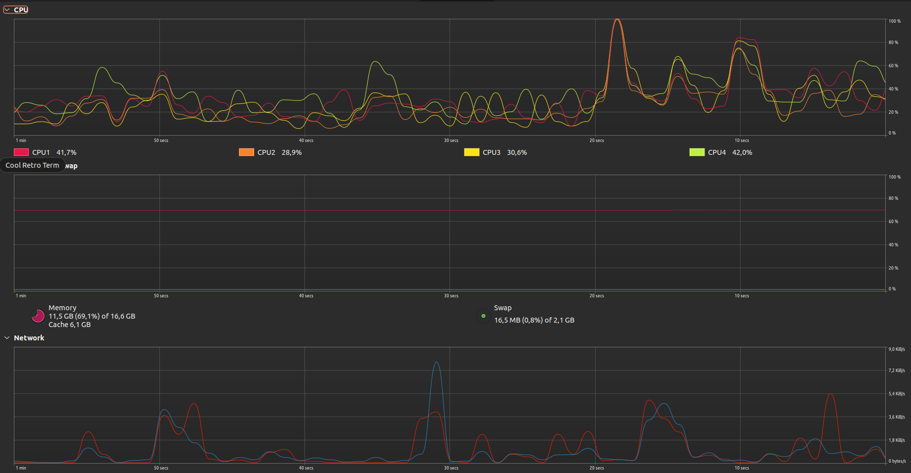

# Previewer

## Install go

[Go install](https://go.dev/doc/install)

## Run it

```shell
go run src/main.go -src "path/to/images" -templates "path/to/templates"
```

## Build docker image
```shell
docker build -t previewer .
```

## Run it in docker
```shell
docker run -v `pwd`/src:/usr/src/app previewer go run src/main.go -src "examples/images" -templates "examples"
```

